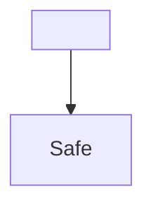

# Security fixture

<a href="javascript:window.__remarkUnsafe = true">bad link</a>
<iframe src="https://example.com"></iframe>

```mermaid
graph TD
  A["<script>window.__remarkUnsafe = true</script>"] --> B[Safe]
```
