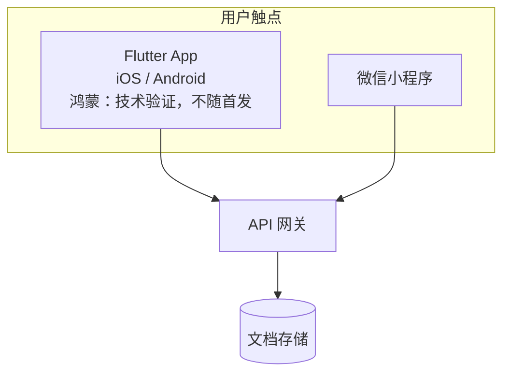

# Mermaid 文字与换行

```mermaid
flowchart TB
  subgraph Client[用户触点]
    APP[Flutter App<br/>iOS / Android<br/>鸿蒙：技术验证，不随首发]
    MP[微信小程序]
  end
  APP --> GW[API 网关]
  MP --> GW
  GW --> DB[(文档存储)]
```
